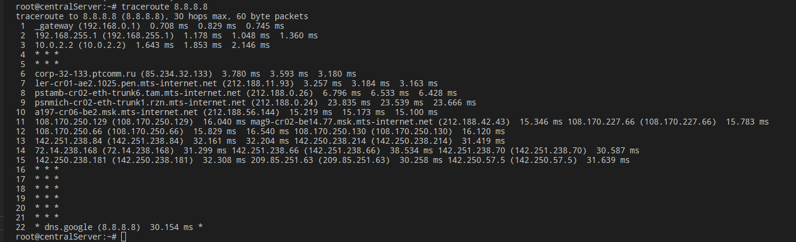
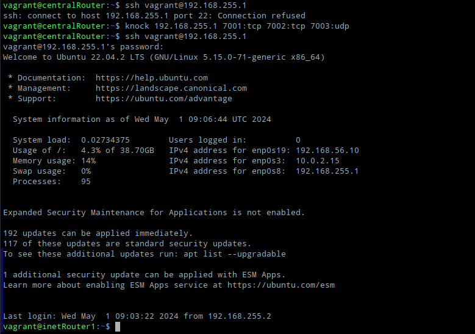
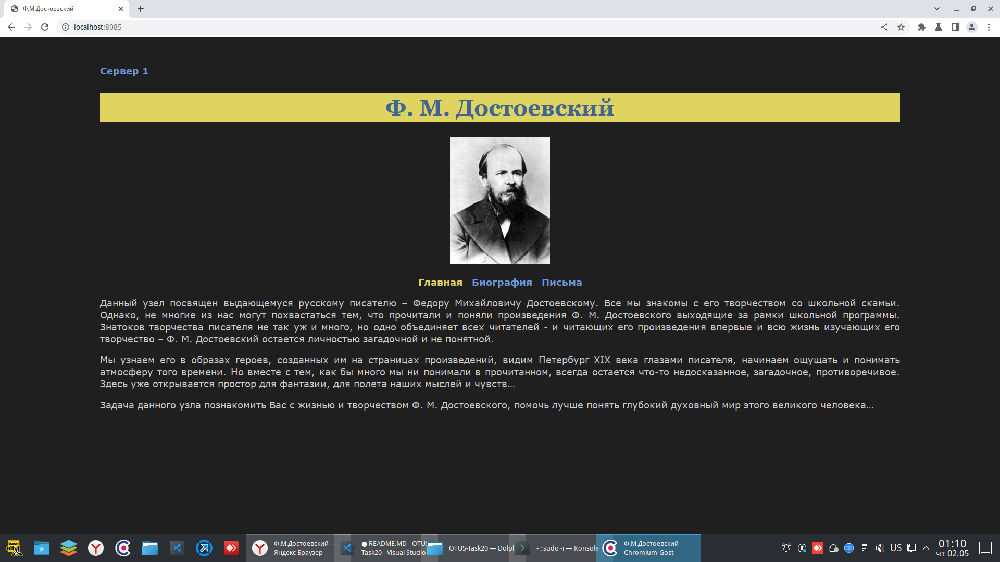

# Задание: Сценарии iptables

Что нужно сделать?

реализовать knocking port
centralRouter может попасть на ssh inetrRouter через knock скрипт
пример в материалах.
добавить inetRouter2, который виден(маршрутизируется (host-only тип сети для виртуалки)) с хоста или форвардится порт через локалхост.
запустить nginx на centralServer.
пробросить 80й порт на inetRouter2 8080.
дефолт в инет оставить через inetRouter.

## Решение

С помощью Vagrant создаётся стенд, состоящий из следующих хостов:
1. inetRouter1
2. inetRouter2
3. centralRouter
4. centralServer

С помощью ansible устанавливается:
- nginx на centralServer
- traceroute на все хосты
- knockd на inetRouter1

Конфигурации сетей и iptables находятся в каталоге templates.
Комментарии по работе Ansible приведены в самом плейбуке.

Результат работы стенда:
1. Доступ в интернет с хоста centralServer через inetRouter1:

2. Доступ по ssh с хоста centralRouter к хосту inetRouter1 только с использованием knokd:

3. Доступ к html странице на centralServer с хостовой машины:

